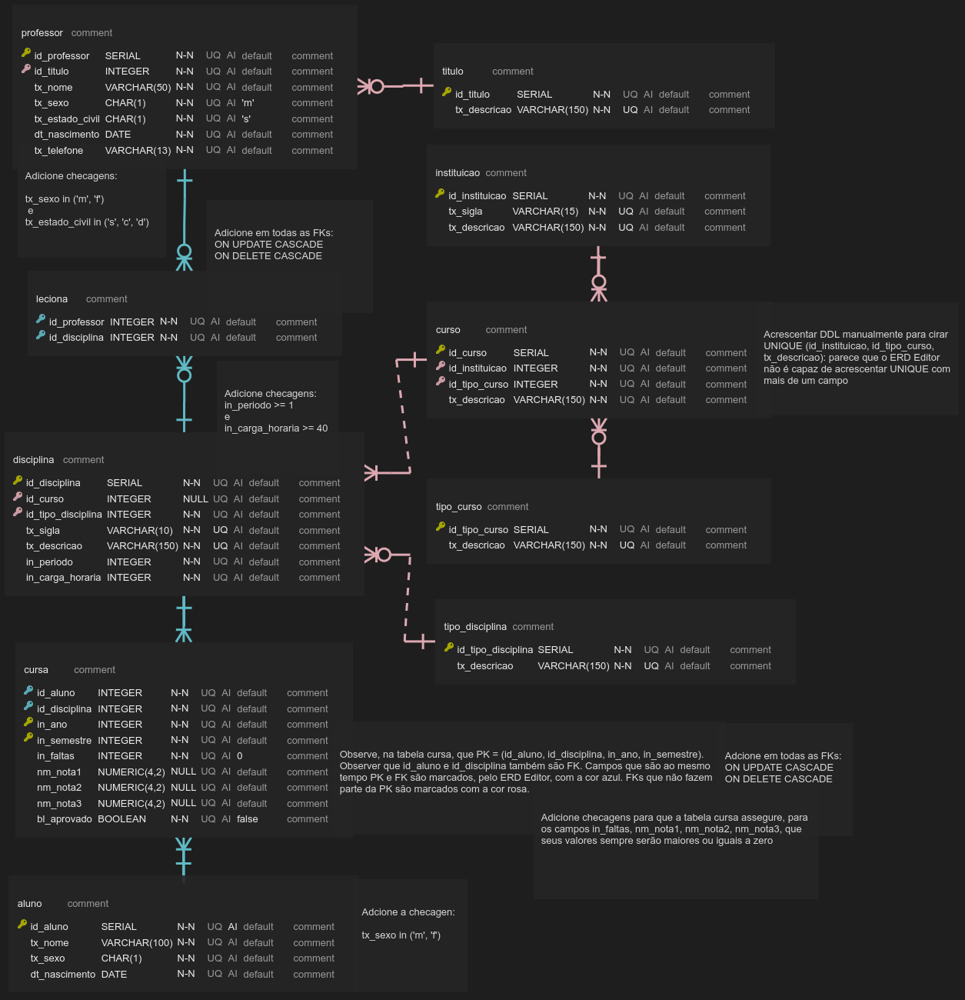

# Exercício acerca do *Hook useReducer*

Esse exercício deve considerar o clone do código público disponibilizado no repositório [alexpaulooliveira/reactjs_exerc__useReducer_start_point](https://github.com/alexpaulooliveira/reactjs_exerc__useReducer_start_point) como ponto de partida. 

### Como baixar, configurar, e executar a aplicação:

Estando na pasta à partir da qual você deseja que a aplicação seja criada, execute o seguinte comando:

```
git clone <endereço do repositório>
```

Depois, instale as bibliotecas listadas no package.json, fazendo uso do seguinte comando:

```
npm install
```

Por fim, execute a aplicação fazendo uso do seguinte comando:


```
npm start
```

## Objetivos do exercício:

### 1) Ajustar o *backend* (*API REST*) acrescentando os métodos que julgar necessário para atingir os objetivos das questões seguintes.

Considere o *ERD* visto na imagem abaixo para programar a *API REST* que atenderá às necessidades do exercício em pauta:



### 2) Crie uma aplicação que disponibilize um combo para que o usuário possa escolhar um dos professores da base. Antes de selecionar o professor, a tela deve ter o seguinte aspecto:


### 3) Quando o professor for selecionado, a tela deve informar as disciplinas vinculadas ao professor, e, também, as que não estão vinculadas, conforme imagem abaixo:


### 4) O sistema deve possibilitar a permuta de disciplinas, entre as categorias "DISCIPLINAS NÃO ALOCADAS" e "DISCIPLINAS ALOCADAS". Para melhorar a performance do sistema, utilize o *Hook useReducer* para assegurar que todas as alterações acontecerão apenas na memória do cliente. Acrescente um botão para carregar novamente o conteúdo original disponibilizado pela *API REST*, desfazendo, assim, todas as alterações realizadas em memória.

